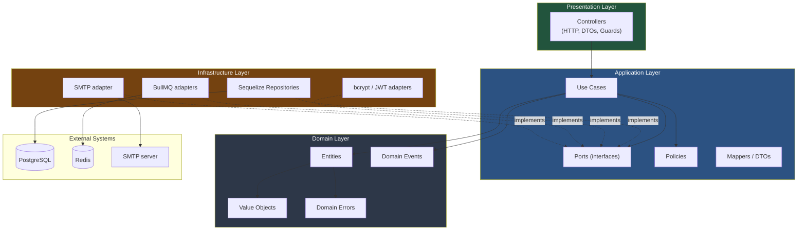
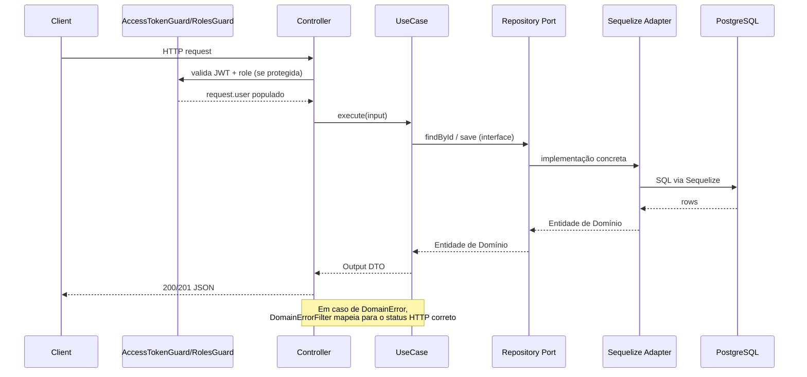
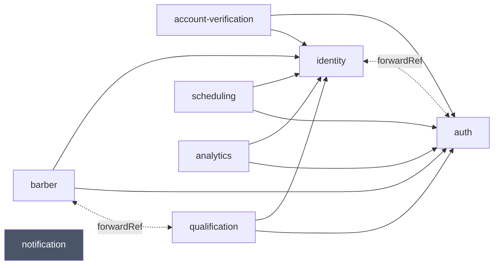
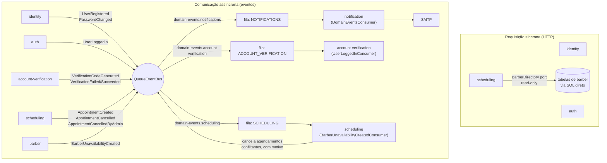
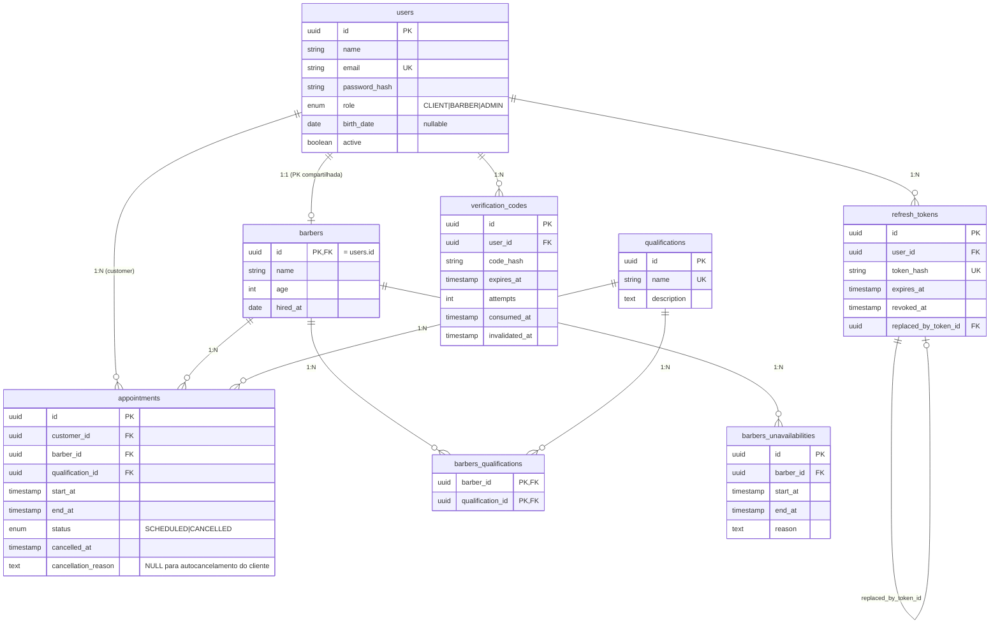
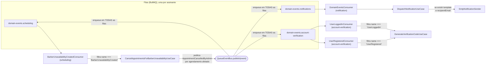
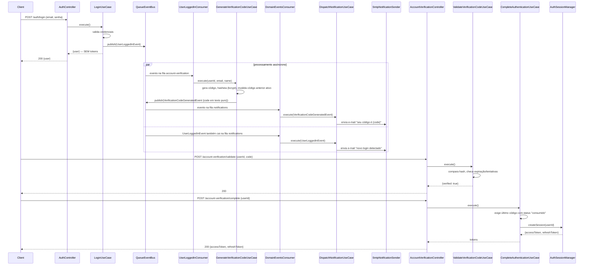
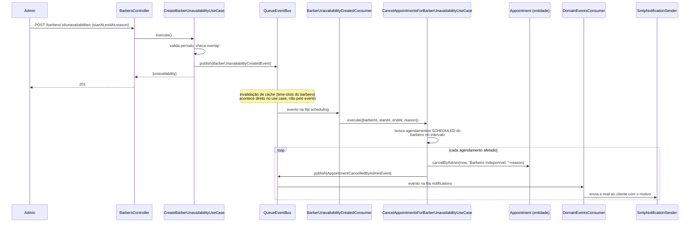

# ClickBeard API

Backend de agendamento para barbearias, construído em **NestJS + TypeScript**, com **Arquitetura Hexagonal (Ports & Adapters)** e **Domain-Driven Design**. Este README é a documentação técnica de referência do projeto: reflete exatamente o que está implementado no código nesta branch, sem funcionalidades hipotéticas.

## Índice

1. [Visão Geral](#1-visão-geral)
2. [Arquitetura](#2-arquitetura)
3. [Estrutura do Projeto](#3-estrutura-do-projeto)
4. [Tecnologias Utilizadas](#4-tecnologias-utilizadas)
5. [Como Executar](#5-como-executar)
6. [Funcionamento da Aplicação](#6-funcionamento-da-aplicação)
7. [Comunicação Entre os Módulos](#7-comunicação-entre-os-módulos)
8. [Banco de Dados](#8-banco-de-dados)
9. [Cache](#9-cache)
10. [Eventos](#10-eventos)
11. [Regras de Negócio](#11-regras-de-negócio)
12. [Cobertura de Testes](#12-cobertura-de-testes)
13. [Tratamento de Falhas](#13-tratamento-de-falhas)
14. [Segurança](#14-segurança)
15. [Performance](#15-performance)
16. [Observabilidade](#16-observabilidade)
17. [Decisões Arquiteturais](#17-decisões-arquiteturais)
18. [Possíveis Melhorias Futuras](#18-possíveis-melhorias-futuras)

---

## 1. Visão Geral

ClickBeard é uma API REST para gestão de uma barbearia: cadastro de clientes/barbeiros/administradores, catálogo de qualificações (serviços), perfis de barbeiro vinculados a qualificações, agendamento de horários com prevenção de conflitos, autenticação em duas etapas (senha + código de verificação por e-mail) e um painel de analytics administrativo com métricas de uso.

**Principais funcionalidades:**

- Cadastro e gestão de usuários com três papéis: `CLIENT`, `BARBER`, `ADMIN`.
- Autenticação com **verificação em duas etapas**: login confirma a senha mas só emite tokens depois que o usuário valida um código de 6+ dígitos enviado por e-mail.
- Sessões via **JWT de acesso + refresh token rotativo**, com revogação e lista de tokens no banco.
- Cadastro de **qualificações** (serviços) e de **barbeiros**, com N:N entre eles.
- **Agendamento de horários** com grade de 30 minutos, horário comercial fixo, aviso mínimo de 2h para cancelar (reservar não exige antecedência mínima), e prevenção de double-booking via índice único parcial no banco. Quando o próprio cliente cancela, ele é notificado por e-mail confirmando o cancelamento.
- **Cancelamento administrativo de agendamentos**: um `ADMIN` pode cancelar qualquer agendamento informando um motivo obrigatório, sem a janela mínima de 2h que se aplica ao cliente; o cliente é notificado por e-mail com o motivo.
- **Indisponibilidade de barbeiros** (faltas/doenças): um `ADMIN` registra um período de indisponibilidade por barbeiro, o que bloqueia novas reservas nesse período e **cancela em cascata** (com notificação por e-mail) qualquer agendamento já existente que caia dentro dele.
- **Analytics administrativo**: métricas de usuários, agendamentos, barbeiros, clientes e ocupação, filtráveis por período.
- **Cache Redis** de leitura em praticamente todo endpoint de consulta, com invalidação explícita por prefixo a cada escrita relevante.
- **Eventos de domínio assíncronos** (BullMQ/Redis) para desacoplar efeitos colaterais (e-mails transacionais) do caminho da requisição HTTP.
- Bootstrap do primeiro `ADMIN` via seeder idempotente (não existe rota pública para isso).

**Principais características não-funcionais:**

- Zero regra de negócio duplicada entre camadas: toda validação vive no Domain (entidades/value objects), nunca em controllers ou DTOs além da validação de shape/tipo.
- Isolamento estrito entre bounded contexts: nenhum arquivo em `core/` de um módulo importa `infrastructure`/`presentation` de outro módulo.
- Toda falha de regra de negócio (`DomainError`) é mapeada para o status HTTP correto por um filtro global — nunca cai em 500 genérico.
- Suite de testes unitários co-localizados (`*.spec.ts` ao lado de cada arquivo) e suite de testes e2e cobrindo as 42 rotas HTTP expostas.

---

## 2. Arquitetura

### 2.1 Estilo arquitetural

O projeto segue **Arquitetura Hexagonal (Ports & Adapters)** combinada com **DDD tático** dentro de cada um dos 8 módulos de negócio, mais uma camada `shared/` com a infraestrutura técnica reaproveitada por todos.

Cada módulo é dividido em três camadas:

| Camada | Conteúdo | Depende de |
|---|---|---|
| **`core/domain`** | Entidades, Value Objects, erros de domínio, eventos de domínio, enums | Nada (nem framework, nem outras camadas) |
| **`core/application`** | Use cases, Ports (interfaces), DTOs internos, mappers, policies | Apenas `core/domain` e interfaces (`ports`) que ele próprio declara |
| **`infrastructure`** | Implementações concretas dos ports (Sequelize, BullMQ, bcrypt, JWT, SMTP...) | `core/application` (implementa seus ports) |
| **`presentation`** | Controllers HTTP, DTOs de request/response, guards, decorators | `core/application` (chama use cases) |

A regra de dependência do DDD/Clean Architecture é respeitada em toda a base: **as setas de dependência sempre apontam para dentro** (`presentation`/`infrastructure` → `application` → `domain`), nunca o contrário. Use cases dependem de **interfaces** (`Port`s) definidas por eles mesmos — quem implementa a interface é a `infrastructure`, injetada via o container de DI do Nest (Dependency Inversion Principle).

### 2.2 Princípios aplicados

- **SOLID**
  - *Single Responsibility*: cada use case faz exatamente uma operação de negócio; entidades protegem seus próprios invariantes.
  - *Open/Closed*: novos adapters (ex.: trocar Redis por outro cache) não exigem alterar use cases, só a implementação do Port e o binding no `index.module.ts`.
  - *Liskov*: toda implementação de Port é substituível pela interface sem alterar o comportamento esperado pelo use case.
  - *Interface Segregation*: Ports são pequenos e focados (ex.: `PasswordHasher` só tem `hash`/`compare`, não um `CryptoService` genérico).
  - *Dependency Inversion*: `core/application` nunca importa uma classe concreta de `infrastructure` — só o token/interface do Port, resolvido via `@Inject` no `index.module.ts`.
- **DDD tático**: Entidades (`Barber`, `Appointment`, `Qualification`, `User`, `VerificationCode`, `RefreshToken`) encapsulam estado e regras via métodos (`cancel()`, `addQualification()`, `consume()`...) — nunca setters públicos. Value Objects (`Email`, `Password`, `Age`, `TimeSlot`, `DateRange`) validam-se na construção e são imutáveis.
- **Bounded Contexts**: cada um dos 8 módulos é um contexto isolado; comunicação entre eles acontece só por **eventos de domínio** (assíncrono) ou por **Ports explícitos que leem um snapshot read-only** (ex.: `BarberDirectory` em `scheduling`, que lê barbeiros sem depender do módulo `barber`).

### 2.3 Diagrama de arquitetura geral



### 2.4 Fluxo de uma requisição



### 2.5 Dependências entre módulos



Todo módulo com rotas HTTP protegidas importa `IdentityModule` + `AuthModule` — não porque seus *use cases* precisem, mas porque o guard `@Auth()` (`AccessTokenGuard`) resolve `TOKEN_PROVIDER` (de `auth`) e `USER_REPOSITORY` (de `identity`) **no escopo do próprio módulo do controller** (é assim que o DI do Nest resolve `UseGuards`). `Barber` e `Qualification` têm uma dependência circular genuína (um barbeiro tem qualificações; excluir uma qualificação precisa checar se algum barbeiro a usa) resolvida com `forwardRef()` nos dois sentidos. `notification` não depende de nenhum outro módulo — é puramente dirigido por eventos.

---

## 3. Estrutura do Projeto

```
ClickBeard_Pablo_Ferrari/
├── src/
│   ├── main.ts                    # Bootstrap real (NestFactory + shutdown hooks)
│   ├── configure-app.ts           # Setup compartilhado entre main.ts e os testes e2e
│   ├── app.module.ts              # Módulo raiz — importa os 8 módulos + infra global
│   ├── modules/                   # Os 8 bounded contexts
│   │   ├── identity/              # Usuários, papéis, senha
│   │   ├── auth/                  # Login, JWT, refresh tokens
│   │   ├── account-verification/  # Código de verificação (2FA por e-mail)
│   │   ├── barber/                # Perfis de barbeiro
│   │   ├── qualification/         # Catálogo de serviços/qualificações
│   │   ├── scheduling/            # Agendamentos e disponibilidade
│   │   ├── notification/          # Disparo de e-mails (só consome eventos)
│   │   └── analytics/             # Métricas administrativas
│   └── shared/                    # Infra técnica reaproveitada por todos os módulos
│       ├── application/           # Contratos cross-module (ports, cache, pagination)
│       ├── cache/                 # Implementação Redis do cache
│       ├── config/                # EnvConfig e configs derivadas (pg, redis, queue)
│       ├── database/              # Módulo Sequelize + tradução de erros de persistência
│       ├── domain/                # Base DomainError + DomainEvent
│       ├── health/                # Health check (Postgres + Redis)
│       ├── presentation/          # DomainErrorFilter, FieldSelectionInterceptor
│       ├── queue/                 # EventBus/MessageQueue sobre BullMQ
│       └── utils/                 # Constantes compartilhadas (ex.: MS_PER_DAY)
├── database/
│   ├── config/config.js           # Config lida só pelo sequelize-cli
│   ├── migrations/                # 10 migrations, uma tabela (ou alteração) por arquivo
│   └── seeders/                   # Seeder do admin inicial
├── test/
│   ├── support/                   # Helpers de e2e (bootstrap de app, spy de e-mail, auth)
│   ├── global-setup.ts            # Roda 1x antes da suíte: limpa e re-semeia o banco de teste
│   └── *.e2e-spec.ts              # Um arquivo por controller
├── scripts/create-test-db.js      # Cria o banco clickbeard_test (idempotente)
├── .github/workflows/ci.yml       # 4 jobs: test, migrations, e2e, docker
├── docker-compose.yml             # app + postgres + redis
├── Dockerfile                     # 4 estágios: base, development, build, production
├── .env.example
└── .env.test                      # Config do banco/infra dedicados à suíte e2e
```

### Convenção por camada dentro de um módulo

| Pasta | Responsabilidade | Quando usar | Exemplo real |
|---|---|---|---|
| `core/domain/entities/` | Estado + invariantes de negócio, sem framework | Ao modelar um conceito com identidade e ciclo de vida | `Appointment` (`cancel()` recusa cancelamento fora da janela de 2h) |
| `core/domain/value-objects/` | Valores imutáveis e auto-validados | Quando um valor primitivo tem regras (formato, faixa) | `Email`, `Age`, `TimeSlot` |
| `core/domain/errors/` | Uma classe por falha de regra de negócio | Toda vez que uma invariante é violada | `BarberTimeSlotConflictError extends ConflictError` |
| `core/domain/events/` | Fatos que já aconteceram, publicados para fora do módulo | Quando outro módulo (ou e-mail) precisa reagir | `AppointmentCreatedEvent` |
| `core/application/use-cases/` | Uma classe por operação, orquestra Ports + Entidades | Um caso de uso por rota/ação de negócio | `CreateAppointmentUseCase` |
| `core/application/ports/` | Interfaces que a Application declara e a Infrastructure implementa | Toda vez que Application precisa de I/O (DB, cache, fila, e-mail) | `AppointmentRepository` |
| `core/application/policies/` | Regras de autorização reaproveitadas por vários use cases do módulo | Quando mais de um use case checa a mesma condição | `ensureRequesterIsAdmin` |
| `core/application/mappers/` | Entidade → DTO de saída do use case | Toda vez que um use case retorna dado para fora do Core | `toAppointmentDto` |
| `infrastructure/persistence/` | Models Sequelize, repositórios concretos, mappers de persistência | Implementação de um Port de repositório | `SequelizeAppointmentRepository` |
| `infrastructure/security/` | Adapters de hashing/token | Implementação de Ports de segurança | `BcryptPasswordHasher`, `JwtTokenProvider` |
| `infrastructure/messaging/` | Consumers de fila (`OnModuleInit` + `MessageQueue.consume`) | Módulo reage a eventos publicados por outro | `UserLoggedInConsumer` |
| `presentation/controllers/` | Endpoints HTTP, thin — só chama um use case e mapeia DTO | Um controller por agregado raiz exposto via HTTP | `AppointmentsController` |
| `presentation/dtos/` | Request/response DTOs com `class-validator` | Toda entrada/saída HTTP | `CreateAppointmentRequestDto` |

`notification` foge do padrão de propósito: não tem `core/domain` (não protege nenhum agregado próprio, só formata e envia mensagens derivadas de eventos de outros módulos) nem `presentation` (não tem nenhuma rota HTTP — é acionado exclusivamente por um consumer de fila).

---

## 4. Tecnologias Utilizadas

### Runtime e framework

| Tecnologia | Versão | Finalidade | Por que foi escolhida |
|---|---|---|---|
| **NestJS** | ^11.0.1 | Framework HTTP + DI container | DI nativo é o que torna Ports & Adapters prático em TypeScript sem boilerplate manual; módulos do Nest mapeiam 1:1 para bounded contexts |
| **TypeScript** | ^5.7.3 | Linguagem | Tipagem estática necessária para os Value Objects/DTOs serem uma barreira real de validação, não só documentação |
| **Node.js 20** (`node:20-slim` na imagem Docker) | — | Runtime | LTS ativo, base `slim` (Debian/glibc) evita ter que compilar `bcrypt` (módulo nativo) do zero como aconteceria em Alpine |

### Persistência

| Tecnologia | Versão | Finalidade | Por que foi escolhida |
|---|---|---|---|
| **PostgreSQL** | 17 (imagem Docker) | Banco relacional principal | Suporta índices parciais (`WHERE status = 'SCHEDULED'`), essencial para a regra de não-double-booking sem lock explícito |
| **Sequelize** + **sequelize-typescript** | ^6.37.8 / ^2.1.6 | ORM | Usado só na camada `infrastructure/persistence` — Core nunca importa Sequelize, then trocar de ORM não vaza para regra de negócio |
| **sequelize-cli** | ^6.6.5 | Migrations/seeders | Migrations vivem fora do `src/` (`database/`), versionadas independentemente do código da aplicação |
| **pg** / **pg-hstore** | ^8.22.0 / ^2.3.4 | Driver Postgres | Dependência do Sequelize + usado por um pool `pg` cru no health check |

### Cache e mensageria

| Tecnologia | Versão | Finalidade | Por que foi escolhida |
|---|---|---|---|
| **Redis** | 8-alpine (imagem Docker) | Cache de leitura + backend do BullMQ | Um único serviço cobre as duas necessidades (cache e fila), reduzindo peças móveis |
| **ioredis** | ^6.0.0 | Cliente Redis | Cliente mais maduro para cenários com BullMQ (que o exige internamente) |
| **BullMQ** + **@nestjs/bullmq** | ^5.81.3 / ^11.0.4 | Fila de jobs / event bus assíncrono | Fornece filas nomeadas com workers dedicados, base do fan-out de eventos de domínio descrito na seção 10 |

### Autenticação e segurança

| Tecnologia | Versão | Finalidade | Por que foi escolhida |
|---|---|---|---|
| **@nestjs/jwt** | ^11.0.2 | Emissão/verificação de JWT | Access e refresh token usam segredos e TTLs completamente independentes |
| **bcrypt** | ^6.0.0 | Hash de senha e de código de verificação | Padrão de mercado para hash de senha; também usado para o código de verificação (nunca fica em texto puro no banco) |
| **helmet** | ^8.3.0 | Headers HTTP de segurança | Aplicado globalmente em `configure-app.ts` |
| **@nestjs/throttler** | ^6.5.0 | Rate limiting global | Guard global via `APP_GUARD`, configurável por env var |
| **class-validator** / **class-transformer** | ^0.15.1 / ^0.5.1 | Validação/transform de DTOs de entrada | `ValidationPipe` global com `whitelist`+`forbidNonWhitelisted`+`transform` — todo campo não declarado no DTO é rejeitado |

### Comunicação e documentação

| Tecnologia | Versão | Finalidade | Por que foi escolhida |
|---|---|---|---|
| **nodemailer** | ^9.0.4 | Envio de e-mail via SMTP | Único adapter concreto do port `NotificationSender` |
| **@nestjs/swagger** + **swagger-ui-express** | ^11.4.6 / ^5.0.1 | Documentação OpenAPI interativa | Gerada a partir dos próprios DTOs decorados, servida em `/docs` |
| **@nestjs/terminus** | ^11.1.1 | Health checks | Indicador nativo do Sequelize + um indicador Redis customizado |

### Qualidade e testes

| Tecnologia | Versão | Finalidade |
|---|---|---|
| **Jest** | ^30.0.0 | Test runner (unitário e e2e) |
| **ts-jest** | ^29.2.5 | Transform TypeScript para Jest |
| **supertest** | ^7.0.0 | Requisições HTTP contra a aplicação real nos testes e2e |
| **ESLint 9 (flat config)** + **typescript-eslint** | ^9.18.0 / ^8.20.0 | Lint estático |
| **Prettier** + **eslint-plugin-prettier** | ^3.4.2 / ^5.2.2 | Formatação, aplicada como regra de lint |
| **ts-node** / **tsconfig-paths** | ^10.9.2 / ^4.2.0 | Execução TS ad-hoc (scripts de debug) |

### Infraestrutura

| Tecnologia | Finalidade |
|---|---|
| **Docker** (multi-stage) + **docker-compose** | Ambiente de desenvolvimento (`app`+`postgres`+`redis`) e imagem de produção |
| **GitHub Actions** | CI com 4 jobs: lint/build/unit, migrations, e2e, build da imagem Docker |

---

## 5. Como Executar

### 5.1 Pré-requisitos

- Node.js 20+
- Docker + Docker Compose (recomendado) **ou** PostgreSQL 17 e Redis 8 instalados localmente

### 5.2 Instalação

**Opção A — script de setup automatizado (recomendado):** instala as dependências, cria o `.env` a partir do `.env.example` (se ainda não existir), sobe `postgres`+`redis` via Docker, roda as migrations e o seeder do admin inicial — tudo em um único comando. Requer Docker rodando; se já existirem containers `postgres`/`redis` de outro projeto usando os mesmos nomes, pare-os antes (`docker rm -f postgres redis`), já que os nomes são fixos no `docker-compose.yml`.

```bash
npm run setup:windows   # Windows (PowerShell)
npm run setup:linex     # Linux
npm run setup:mac       # macOS
```

Os três apontam, respectivamente, para `scripts/setup.ps1` e `scripts/setup.sh` (o mesmo script serve Linux e macOS). Ao final, o admin inicial já está semeado e a aplicação pode ser iniciada com `npm run dev`. Como o `.env` só é criado se ainda não existir, rodar o script de novo é seguro (idempotente) — reexecuta `npm install`, sobe os containers se estiverem parados e reaplica apenas migrations/seeds pendentes.

**Opção B — manual:**

```bash
npm install
cp .env.example .env
# edite .env: JWT_ACCESS_SECRET, JWT_REFRESH_SECRET, SEED_ADMIN_PASSWORD, etc.
```

### 5.3 Variáveis de ambiente

Todas validadas na inicialização por `EnvConfig` (`src/shared/config/env.config.ts`) — a aplicação falha ao subir se alguma obrigatória estiver ausente ou mal formatada.

| Variável | Obrigatória | Default | Descrição |
|---|---|---|---|
| `NODE_ENV` | não | `development` | `development` \| `production` \| `test` |
| `PORT` | sim | — | Porta HTTP |
| `DB_HOST`, `DB_PORT`, `DB_USER`, `DB_PASSWORD`, `DB_NAME` | sim | — | Conexão Postgres |
| `DB_POOL_MAX` / `DB_POOL_MIN` | não | `10` / `0` | Pool de conexões Sequelize |
| `DB_POOL_IDLE_MS` / `DB_POOL_ACQUIRE_MS` | não | `10000` / `30000` | Timeouts do pool |
| `DB_SSL` | não | `false` | Ativa `ssl.rejectUnauthorized: false` na conexão |
| `REDIS_HOST`, `REDIS_PORT` | sim | — | Conexão Redis (cache + BullMQ) |
| `REDIS_PASSWORD` | não | — | — |
| `JWT_ACCESS_SECRET` / `JWT_REFRESH_SECRET` | sim | — | Segredos **distintos** para access e refresh token |
| `JWT_ACCESS_EXPIRES_IN` / `JWT_REFRESH_EXPIRES_IN` | não | `15m` / `7d` | TTL dos tokens |
| `BCRYPT_SALT_ROUNDS` | não | `10` | Rounds de hash (senha e código de verificação) |
| `SMTP_HOST`, `SMTP_FROM` | sim | — | Envio de e-mail |
| `SMTP_PORT` | não | `587` | — |
| `SMTP_USER` / `SMTP_PASSWORD` | não | — | — |
| `SMTP_SECURE` | não | `false` | — |
| `SYSTEM_LANGUAGE` | não | `en` (fallback) | Idioma dos e-mails transacionais — só `pt-BR` (e variantes como `pt`/`pt_BR`) é reconhecido como alternativa; qualquer outro valor, ou ausente, cai em `en` |
| `CORS_ORIGIN` | não | `*` | `*` ou lista separada por vírgula |
| `THROTTLE_TTL_MS` / `THROTTLE_LIMIT` | não | `60000` / `100` | Janela e limite do rate limiter global |
| `SEED_ADMIN_NAME` / `SEED_ADMIN_EMAIL` / `SEED_ADMIN_PASSWORD` | apenas para `seed:up` | — | **Não lidas pela aplicação em runtime** — só pelo seeder do admin inicial |

### 5.4 Subindo com Docker (recomendado)

```bash
npm run docker:up          # sobe app + postgres + redis (build target: development)
npm run migration:up       # roda as 10 migrations
npm run seed:up            # cria o admin inicial (usa SEED_ADMIN_* do .env)
npm run docker:logs        # acompanha os logs
```

A API sobe em `http://localhost:${PORT}`, com hot-reload (`nest start --watch`) via bind mount do código-fonte.

### 5.5 Executando localmente (sem Docker para a app)

```bash
npm run db:up               # só postgres + redis via Docker
npm run migration:up
npm run seed:up
npm run start:dev           # nest start --watch
```

### 5.6 Produção

```bash
docker build --target production -t clickbeard-api .
docker run --env-file .env -p 3000:3000 clickbeard-api
```

O estágio `production` do `Dockerfile` copia apenas o `dist/` compilado e instala só `dependencies` (sem devDependencies).

### 5.7 Testes

```bash
npm test                    # testes unitários (*.spec.ts, co-localizados no código)
npm run test:cov            # com relatório de cobertura
npm run test:e2e            # suite e2e (requer Postgres/Redis reais rodando — ver seção 12)
```

### 5.8 Build

```bash
npm run build                # nest build -> dist/
npm run start:prod           # node dist/main
```

### 5.9 Documentação interativa

Com a aplicação rodando: `http://localhost:${PORT}/docs` (Swagger UI, gerado a partir dos DTOs decorados).

---

## 6. Funcionamento da Aplicação

Toda requisição HTTP segue o mesmo caminho, independente do módulo:

```
Cliente
  │  HTTP request (JSON)
  ▼
Guard (opcional — AccessTokenGuard + RolesGuard/SelfOrAdminGuard)
  │  valida JWT, injeta request.user
  ▼
Controller (presentation/controllers)
  │  ValidationPipe já validou o DTO de entrada
  │  monta o input do use case, injeta requesterId quando relevante
  ▼
Use Case (core/application/use-cases)
  │  orquestra: busca via Repository Port, valida regra via Entidade/Policy,
  │  persiste via Repository Port, publica Domain Event se necessário
  ▼
Repository Port (interface, core/application/ports)
  │  resolvido pelo Nest DI para a implementação concreta
  ▼
Repository Implementation (infrastructure/persistence)
  │  Sequelize: monta a query, mapeia row ↔ Entidade
  ▼
PostgreSQL
  │  retorna rows
  ▼
Repository Implementation
  │  reconstrói a Entidade de Domínio (Entity.restore(...))
  ▼
Use Case
  │  mapeia Entidade → DTO de saída (mapper)
  ▼
Controller
  │  retorna o DTO (FieldSelectionInterceptor pode filtrar campos via ?fields=)
  ▼
Cliente
  HTTP response (200/201/204, ou 4xx mapeado por DomainErrorFilter)
```

Cada etapa tem uma responsabilidade única e não conhece a etapa duas posições adiante: o Controller não sabe que existe Sequelize; o Use Case não sabe que existe Express; a Entidade não sabe que existe HTTP.

---

## 7. Comunicação Entre os Módulos

Módulos se comunicam de **duas formas**, nunca chamando a Application de outro módulo diretamente:

1. **Eventos de domínio assíncronos** (a forma preferida) — publicados via o Port `EventBus`, entregues por fila (ver seção 10). É assim que `identity`→`notification`, `auth`→`account-verification`, `account-verification`→`notification`, `scheduling`→`notification` e `barber`→`scheduling` se comunicam.
2. **Ports read-only síncronos**, quando um módulo precisa ler (nunca escrever) um dado que pertence a outro contexto, sem esperar um evento. Exemplo: `scheduling` precisa saber se um barbeiro existe/está ativo e quais qualificações ele tem — em vez de importar o módulo `barber`, declara seu próprio Port `BarberDirectory` (com o shape mínimo que precisa, `BarberSnapshot`), implementado em `infrastructure` por uma query SQL direta nas tabelas `barbers`/`users`/`barbers_qualifications` (não usa os models Sequelize do módulo `barber`). Isso preserva o isolamento do bounded context até na camada de infraestrutura.

### 7.1 Bounded Contexts e seus Ports de leitura cross-module

| Módulo consumidor | Port declarado | Implementado lendo de |
|---|---|---|
| `scheduling` | `BarberDirectory` | tabelas `barbers`/`users`/`barbers_qualifications` (SQL direto, não os models do módulo `barber`) |
| `scheduling` | `AvailabilityService.isBarberUnavailable`/`getUnavailableSlots` | tabela `barbers_unavailabilities` (SQL direto, mesma técnica — o módulo `barber` é dono da tabela, `scheduling` só a lê) |
| `barber` | `QualificationRepository` (do módulo `qualification`, injetado via `forwardRef`) | módulo `qualification` diretamente — única exceção ao padrão acima, documentada e deliberada |

### 7.2 Diagrama de comunicação entre módulos



Nenhum publisher sabe quem consome seu evento — `identity` publica `UserRegistered` sem saber que `notification` existe. Isso é o que permite adicionar um novo consumidor (ex.: um futuro `AnalyticsCountersConsumer`) sem tocar em nenhum publisher existente. `barber` é o exemplo mais recente disso: publica `BarberUnavailabilityCreated` sem nunca importar nem saber que `scheduling` existe — `scheduling` que decidiu se inscrever nesse evento (via seu próprio consumer) para cancelar agendamentos conflitantes.

---

## 8. Banco de Dados

**PostgreSQL 17**, acessado via Sequelize apenas pela camada `infrastructure/persistence` de cada módulo. Schema versionado por 10 migrations (`database/migrations/`, `sequelize-cli`).

### 8.1 Entidades e relacionamentos



### 8.2 Tabelas (na ordem das migrations)

**`users`** — `id UUID PK`, `name`, `email` (índice único `users_email_unique`), `password_hash`, `role ENUM('CLIENT','BARBER','ADMIN')` default `CLIENT` (índice `users_role_idx`), `birth_date DATE` nullable, `active BOOLEAN` default `true`, `created_at`, `updated_at`.

**`qualifications`** — `id UUID PK`, `name` (índice único `qualifications_name_unique`), `description TEXT` opcional, `created_at`, `updated_at`.

**`barbers`** — `id UUID PK`, também **FK para `users.id`** (`onDelete: RESTRICT`) — um barbeiro *é* a extensão de um `User` com `role=BARBER`, não uma entidade independente com id próprio. `name`, `age INTEGER`, `hired_at DATE`, `created_at`, `updated_at`.

**`barbers_qualifications`** (tabela de junção N:N) — PK composta (`barber_id`, `qualification_id`), `barber_id FK` (`onDelete: CASCADE`), `qualification_id FK` (`onDelete: RESTRICT` — não é possível excluir uma qualificação em uso), índice em `qualification_id`. A PK composta já garante "sem qualificação duplicada por barbeiro", sem precisar de índice único adicional.

**`refresh_tokens`** — `id UUID PK`, `user_id FK` (`onDelete: CASCADE`), `token_hash` (índice único `refresh_tokens_token_hash_unique` — o token nunca é guardado em texto puro), `expires_at`, `revoked_at` opcional, `replaced_by_token_id` (FK auto-referenciada, `onDelete: SET NULL` — encadeia a rotação), `created_at`. Índice em `user_id`.

**`verification_codes`** — `id UUID PK`, `user_id FK` (`onDelete: CASCADE`), `code_hash` (nunca texto puro), `expires_at`, `attempts INTEGER` default `0`, `consumed_at`/`invalidated_at` opcionais, `created_at`. Índices em `user_id` e `expires_at`.

**`appointments`** — `id UUID PK`, `customer_id FK → users` (`RESTRICT`), `barber_id FK → barbers` (`RESTRICT`), `qualification_id FK → qualifications` (`RESTRICT`), `start_at`/`end_at`, `status ENUM('SCHEDULED','CANCELLED')` default `SCHEDULED`, `cancelled_at` opcional, `cancellation_reason TEXT` opcional (preenchido apenas quando o cancelamento é administrativo — `NULL` quando o próprio cliente cancela), `created_at`, `updated_at`. Índices em `customer_id` e `start_at`.

**`barbers_unavailabilities`** — `id UUID PK`, `barber_id FK → barbers` (`onDelete: CASCADE`), `start_at`/`end_at TIMESTAMP` (não `DATEONLY` — permite indisponibilidade parcial de um dia, ex. "sai às 14h hoje"), `reason TEXT` obrigatório, `created_at`. Índices em `barber_id` e `start_at`. Sem constraint de banco contra sobreposição de períodos do mesmo barbeiro (não expressável como índice único simples); a checagem é em nível de aplicação (`existsOverlapping`), mesmo trade-off já aceito em outros pontos do sistema.

### 8.3 Constraint que garante a regra de negócio mais importante

```sql
CREATE UNIQUE INDEX appointments_barber_id_start_at_active_unique
  ON appointments (barber_id, start_at)
  WHERE status = 'SCHEDULED';
```

Um **índice único parcial**: só considera linhas com `status = 'SCHEDULED'`. Isso é o que impede double-booking (dois agendamentos ativos para o mesmo barbeiro no mesmo horário) **no nível do banco**, não só na Application — mesmo sob concorrência, o Postgres rejeita a segunda inserção. Um horário cancelado libera o slot automaticamente para uma nova reserva, porque deixa de satisfazer o `WHERE`.

### 8.4 Estratégia de persistência

- Toda tabela usa `UUID` como chave primária (gerado em `Entity.create()`, na camada de Domínio — nunca `SERIAL`/autoincrement do banco, para que a entidade tenha um id válido antes mesmo de ser persistida).
- `barbers.id` é deliberadamente igual a `users.id` (não um UUID novo) — modela explicitamente "Barber é um papel que User assume", evitando um segundo id para a mesma pessoa.
- Toda migration que precisa de índice único usa `queryInterface.addIndex(...)` explícito em vez de `unique: true` inline na coluna — mais confiável entre dialetos, e comentado como tal nas próprias migrations.
- `AsyncLocalStorage` (`shared/database/transaction-context.ts`) propaga a transação Sequelize ativa implicitamente por todos os repositórios chamados dentro de `TransactionManager.runInTransaction(...)`, sem precisar passar a transação manualmente por cada camada.
- Erros brutos do driver (`pg`/Sequelize) nunca vazam para fora de um repositório: `mapToPersistenceError()` os traduz para `DatabaseUnavailableError` / `DatabaseTimeoutError` / `DatabaseConflictError` / `UnexpectedPersistenceError` (ver seção 13).

---

## 9. Cache

**Redis**, acessado via o Port `CacheManager` (implementado por `RedisCacheManager`). Aplicado por composição, não por decorator espalhado pelo código: cada use case cacheável é envolvido por `CachedUseCase` (leitura) ou `CacheInvalidatingUseCase` (escrita que invalida) na hora de ser registrado no `index.module.ts` do módulo — o use case em si não sabe que está sendo cacheado.

### 9.1 Recursos cacheados e TTL

| `CacheResource` | TTL | Use case | Chave |
|---|---|---|---|
| `USER_PROFILE` | 5 min | `GetUserProfileUseCase` | `user:{userId}` |
| `BARBER` | 5 min | `GetBarberUseCase` | `barber:{barberId}` |
| `BARBERS_LIST` | 5 min | `ListBarbersUseCase` | `barbers:list:{page}` |
| `QUALIFICATIONS` | 15 min | `ListQualificationsUseCase` | `qualifications` (chave única, lista global) |
| `APPOINTMENT` | 1 min | `GetAppointmentUseCase` | `appointment:{id}:{requesterId}` (**escopada por requester**) |
| `CUSTOMER_APPOINTMENTS` | 1 min | `ListCustomerAppointmentsUseCase` | `appointments:{requesterId}:{page}` (mesmo namespace para um `CLIENT` listando como cliente ou um `BARBER` listando como cliente **e** profissional — ver seção 11.6) |
| `TODAY_APPOINTMENTS` | 1 min | `ListTodayAppointmentsUseCase` | `appointments:today:{page}` |
| `FUTURE_APPOINTMENTS` | 1 min | `ListFutureAppointmentsUseCase` | `appointments:future:{page}:{startAt ou '-'}:{endAt ou '-'}` (o período opcional entra na chave — filtros diferentes na mesma página não colidem) |
| `AVAILABLE_TIME_SLOTS` | 30 s | `ListAvailableTimeSlotsUseCase` | `time-slots:{barberId}:{data}:{qualificationId}` |
| `DASHBOARD_METRICS` | 5 min | `GetDashboardMetricsUseCase` | `dashboard:{período}` |
| `USER_METRICS` / `APPOINTMENT_METRICS` / `BARBER_METRICS` / `OCCUPATION_METRICS` | 5 min | respectivos use cases de analytics | `metrics:{tipo}:{período}` |
| `CUSTOMER_METRICS` | 5 min | `GetCustomerMetricsUseCase` | `metrics:customers:{período}:{customerId ou 'all'}` |

TTL default para qualquer recurso não mapeado: 1 hora (`DEFAULT_TTL_SECONDS`, `StaticCachePolicy`).

### 9.2 Por que `TODAY_APPOINTMENTS`/`FUTURE_APPOINTMENTS`/analytics não são escopados por usuário

Essas chaves **não** incluem o id do requester, ao contrário de `APPOINTMENT` (que inclui). Isso é seguro porque as rotas que os alimentam (`GET /appointments/today`, `/future`, e todas as de `/analytics/*`) são `@Auth(UserRole.ADMIN)` — o guard roda **antes** de qualquer leitura de cache, então nenhum não-admin consegue chegar ao dado cacheado nem por um "hit" populado por outro admin. Um recurso que exige checagem de dono dentro do próprio use case (como `GetAppointmentUseCase`, que aceita tanto o dono quanto um admin) precisa da chave escopada, porque o cache-hit pularia essa checagem.

### 9.3 Invalidação

Toda escrita relevante invalida por **prefixo** (`deleteByPrefix`, via `SCAN` + `DEL` em lote, nunca `KEYS *` bloqueante), não por chave exata — porque uma escrita normalmente invalida várias páginas/variações de uma vez:

- `CreateAppointmentUseCase`/`CancelAppointmentUseCase` invalidam: o slot de horário do barbeiro no dia (`barberTimeSlotsPrefix`), a lista de agendamentos do cliente **e** a lista de agendamentos do barbeiro (`customerAppointmentsPrefix`, aplicado a `customerId` e a `barberId` — mesmo prefixo, já que a chave de `CUSTOMER_APPOINTMENTS` é por `requesterId`, não por papel; ver seção 11.6), **e** `todayAppointmentsPrefix()`/`futureAppointmentsPrefix()` — confirmado necessário porque a query real (`findByDate`/`findUpcoming`) não filtra por status, então até um agendamento cancelado continua aparecendo nessas listas.
- `CreateBarberUseCase`/`UpdateBarberUseCase`/`AddQualificationToBarberUseCase`/`RemoveQualificationFromBarberUseCase` invalidam `barber:{id}` e `barbers:list:*`.
- `CreateQualificationUseCase`/`UpdateQualificationUseCase`/`DeleteQualificationUseCase` invalidam a chave única `qualifications`.
- `ChangePasswordUseCase`/`ChangeUserRoleUseCase`/`DeactivateUserUseCase`/`ActivateUserUseCase` invalidam `user:{id}`.
- `CancelAppointmentByAdminUseCase` invalida exatamente os mesmos prefixos de `CancelAppointmentUseCase` (é o mesmo efeito de negócio — um agendamento deixou de estar `SCHEDULED` — só muda quem o disparou e se um motivo foi registrado).
- `CreateBarberUnavailabilityUseCase`/`DeleteBarberUnavailabilityUseCase` invalidam `time-slots:{barberId}:*` via um novo helper, `CacheKeyGenerator.barberAllTimeSlotsPrefix(barberId)` — **sem** o segmento de data que `barberTimeSlotsPrefix` normalmente exige, porque um período de indisponibilidade pode cobrir vários dias de uma vez; invalidar dia a dia seria mais uma chamada por dia coberto, sem necessidade real dado que `AVAILABLE_TIME_SLOTS` já expira em 30s.

### 9.4 Impacto de uma falha do Redis

Ver seção 13 — o cache **nunca** propaga uma falha de conexão para o use case; degrada para miss/no-op silencioso.

---

## 10. Eventos

Toda comunicação assíncrona usa a mesma abstração: um use case publica um `DomainEvent` através do Port `EventBus`; `QueueEventBus` (implementação real) **replica o evento em todas as filas de assinantes** (fan-out); cada módulo assinante roda seu próprio `Worker` BullMQ e filtra pelo `name` do evento que lhe interessa.



Por que fan-out e não uma fila única compartilhada: BullMQ é *competing consumer* — dois `Worker`s na mesma fila dividem os jobs entre si, um nunca recebe o que o outro já pegou. Como `notification`, `account-verification` e `scheduling` precisam **cada um** ver os eventos que lhe interessam de forma independente, cada assinante tem sua própria fila nomeada (`DOMAIN_EVENTS_CHANNELS`), e o publisher grava a cópia do evento em todas elas — o mesmo formato de um tópico SNS alimentando várias filas SQS. `DOMAIN_EVENTS_CHANNELS` é o único ponto de código que precisa mudar para adicionar um assinante novo — `QueueEventBus.publish` itera `Object.values(DOMAIN_EVENTS_CHANNELS)` genericamente, nada está hardcoded para "2 canais".

### 10.1 Catálogo de eventos

| Evento (`name`) | Publicado por | Payload | `recipientEmail`? | Consumido por |
|---|---|---|---|---|
| `UserRegistered` | `RegisterUserUseCase` | `{ userId, name }` | sim | `notification` (e-mail de boas-vindas) **e** `account-verification` (`UserRegisteredConsumer`, gera o código de verificação imediatamente — um novo cadastro não precisa esperar um primeiro login para receber o código) |
| `PasswordChanged` | `ChangePasswordUseCase` | `{ name }` | sim | `notification` (alerta de segurança) |
| `UserLoggedIn` | `LoginUseCase` | `{ userId, name }` | sim | `notification` (e-mail "novo login") **e** `account-verification` (`UserLoggedInConsumer`, dispara a geração do código) |
| `VerificationCodeGenerated` | `GenerateVerificationCodeUseCase` | `{ name, code }` (código **em texto puro**, só existe neste payload em memória — no banco já está hasheado) | sim | `notification` (e-mail com o código) |
| `VerificationFailed` | `ValidateVerificationCodeUseCase` | `{ userId, reason }` | não | nenhum consumidor hoje (publicado para observabilidade/uso futuro) |
| `VerificationSucceeded` | `ValidateVerificationCodeUseCase` | `{ userId }` | não | nenhum consumidor hoje |
| `AppointmentCreated` | `CreateAppointmentUseCase` | `{ appointmentId, customerId, barberId, qualificationId, startAt }` | não | nenhum consumidor hoje |
| `AppointmentCancelled` | `CancelAppointmentUseCase` (cliente cancela o próprio) | `{ appointmentId, customerId, barberId, startAt, name }` | sim | `notification` (e-mail "seu agendamento foi cancelado") |
| `AppointmentCancelledByAdmin` | `CancelAppointmentByAdminUseCase` **e** `CancelAppointmentsForBarberUnavailabilityUseCase` (cascata de indisponibilidade) | `{ appointmentId, customerId, barberId, startAt, reason, name }` | sim | `notification` (e-mail "seu agendamento foi cancelado", com o motivo) |
| `BarberUnavailabilityCreated` | `CreateBarberUnavailabilityUseCase` | `{ unavailabilityId, barberId, startAt, endAt, reason }` | não | `scheduling` (`BarberUnavailabilityCreatedConsumer`, cancela em cascata todo agendamento `SCHEDULED` do barbeiro que caia dentro do período) |

Eventos sem `recipientEmail` ou sem template cadastrado em `StaticMessageTemplateProvider` simplesmente não geram e-mail — `DispatchNotificationUseCase` faz no-op nesses casos por design, não é uma lacuna.

Todo e-mail transacional é enviado nos dois formatos simultaneamente: `text` (corpo puro do template) e `html` (`renderBrandedEmailHtml`, layout table-based com estilos inline embutidos — a única abordagem que renderiza de forma consistente em clientes como o Outlook, que ignoram CSS moderno e removem blocos `<style>`; sem assets externos, para não depender de imagem/webfont remota). O idioma é resolvido por `DefaultLanguageResolver` a partir de `SYSTEM_LANGUAGE` (seção 5.3) — hoje uma configuração única por deployment, não por destinatário, porque `User` ainda não tem um campo de idioma/locale e o disparo acontece num consumer de fila, sem request HTTP para ler um `Accept-Language`. `StaticMessageTemplateProvider` guarda um par de templates (`en`/`pt-BR`) por evento; qualquer idioma não reconhecido cai em `en` (`DEFAULT_LANGUAGE`).

### 10.2 Fluxo completo: login → verificação → sessão

O fluxo mais complexo do sistema. Login **nunca** emite token na mesma requisição — só confirma a senha e dispara, de forma assíncrona, o envio de um código por e-mail que precisa ser validado antes de qualquer sessão existir.

`POST /users` (`RegisterUserUseCase`) entra nesse mesmo fluxo por um segundo caminho: publica `UserRegistered`, que `UserRegisteredConsumer` (mirror de `UserLoggedInConsumer`, mesma fila `account-verification`) também usa para acionar `GenerateVerificationCodeUseCase` — um cadastro novo já recebe o código de verificação por e-mail sem precisar de um primeiro login. Dali em diante (validação → complete → sessão) é o mesmo caminho do diagrama abaixo.



### 10.3 Fluxo: indisponibilidade de barbeiro → cancelamento em cascata



Reaproveita inteiramente o mecanismo da seção 10.1/`AppointmentCancelledByAdmin` — a cascata não é um caminho de notificação separado, é o mesmo evento e o mesmo template, só que publicado por um caminho diferente (`CancelAppointmentsForBarberUnavailabilityUseCase` em vez de `CancelAppointmentByAdminUseCase`).

### 10.4 Job recorrente (não é um evento, mas usa a mesma infraestrutura BullMQ)

`ExpiredCodesSweepScheduler` roda `InvalidateExpiredVerificationCodesUseCase` a cada 15 minutos, numa fila BullMQ própria (`account-verification.expired-codes-sweep`) com `repeat.jobId` fixo — o BullMQ deduplica pelo `jobId`, então rodar a aplicação em várias instâncias nunca dispara a varredura mais de uma vez por intervalo (um `setInterval` por processo, em contraste, disparia uma vez por instância).

---

## 11. Regras de Negócio

### 11.1 Identity (usuários)

| Regra | Detalhe |
|---|---|
| E-mail válido | Regex `^[^\s@]+@[^\s@]+\.[^\s@]+$`, normalizado para minúsculas e trim antes de comparar/persistir |
| Senha forte | Mínimo 8 caracteres, pelo menos 1 letra e 1 número (`PlainPassword.create`) |
| Papéis | `CLIENT`, `BARBER`, `ADMIN` |
| **Todo cadastro nasce `CLIENT`** | `RegisterUserUseCase` não aceita `role` — não existe caso de uso dedicado para criar `BARBER` ou `ADMIN` diretamente |
| **`ADMIN` só existe por promoção de um `ADMIN` existente** | `ChangeUserRoleUseCase` (`PATCH /users/:id/role`, `@Auth(UserRole.ADMIN)`) troca o papel de um usuário entre `CLIENT` e `ADMIN`. Sem isso, não existiria forma de criar o primeiro admin — daí o seeder |
| **`BARBER` não pode ser atribuído via `PATCH /users/:id/role`** | `ChangeUserRoleUseCase` rejeita `role=BARBER` com `BarberRoleChangeNotAllowedError` (400) — não existe (nem existiu antes) promoção de usuário a barbeiro por essa rota. O único caminho para um usuário virar `BARBER` é um `ADMIN` criar o perfil de barbeiro via `POST /barbers` (seção 11.4), que promove o usuário como parte da própria criação. A rota ainda permite regredir um `BARBER` de volta a `CLIENT` |
| Data de nascimento é opcional | `birthDate` em `RegisterUserRequestDto`/`UpdateUserProfileRequestDto`, validado por `BirthDate` (não pode ser uma data futura) quando informado |
| Usuário edita seu próprio nome/data de nascimento | `PATCH /users/:id/profile`, self-only (nem admin pode agir por outro usuário aqui) — separado da troca de senha (`PATCH /users/:id/password`, self-or-admin) |
| Um `ADMIN` nunca pode ser desativado, por ninguém | `User.deactivate()` rejeita incondicionalmente quando `role === ADMIN` (`AdminCannotBeDeactivatedError`), antes mesmo de checar se já está inativo |
| Trocar para a mesma senha/papel é rejeitado | `SamePasswordError` / `SameUserRoleError` |

### 11.2 Auth (sessão)

| Regra | Detalhe |
|---|---|
| Login não emite sessão | Só confirma credenciais e publica `UserLoggedIn` — tokens só existem após a verificação de 2 etapas |
| Access e refresh token com segredos/TTL independentes | `JWT_ACCESS_SECRET`/`JWT_ACCESS_EXPIRES_IN` (default 15m) vs `JWT_REFRESH_SECRET`/`JWT_REFRESH_EXPIRES_IN` (default 7d) |
| Refresh token é rotativo | Cada `POST /auth/refresh-token` revoga o token usado e emite um par novo, encadeado via `replaced_by_token_id` — um refresh token só pode ser usado uma vez |
| Refresh token guardado como hash | `token_hash` (SHA-256), nunca o token em texto puro no banco |
| Logout revoga o refresh token | Torna-o inutilizável mesmo que ainda não tenha expirado |

### 11.3 Account Verification (2FA)

| Regra | Detalhe |
|---|---|
| Código expira em 10 minutos | `CODE_TTL_MINUTES = 10` |
| Máximo 5 tentativas | `MAX_ATTEMPTS = 5` — excedido, `VerificationCodeAttemptsExceededError` |
| Um único código ativo por usuário | Gerar um novo (login ou resend) invalida qualquer código anterior ainda ativo |
| Código hasheado com bcrypt | Nunca fica em texto puro no banco — só existe em claro no payload em memória do evento, até ser enviado por e-mail |
| Sessão só é criada se o **último** código estiver consumido | `CompleteAuthenticationUseCase` re-checa isso no banco, não confia que `validate` foi chamado antes |
| Varredura periódica invalida códigos expirados | A cada 15 minutos, via `ExpiredCodesSweepScheduler` |
| `POST /account-verification/resend` recebe só `{ userId }` | O e-mail/nome de destino são resolvidos a partir do usuário no banco, nunca aceitos do client — impede que quem descubra um `userId` redirecione o código para um e-mail arbitrário |

### 11.4 Barber

| Regra | Detalhe |
|---|---|
| Idade entre 18 e 100 anos | `Age.create()` |
| **Criar um barbeiro promove o usuário a `BARBER` automaticamente — não há promoção separada** | `CreateBarberUseCase` (`POST /barbers`, `@Auth(UserRole.ADMIN)`) busca o `User` pelo `email` informado; se o papel atual não for `BARBER`, chama `user.changeRole(BARBER)` e persiste **antes** de gravar o perfil de barbeiro — o que também torna uma nova tentativa após falha idempotente (se já estiver `BARBER`, o passo é pulado). Um `User` com `role=ADMIN` não pode virar barbeiro (`AdminCannotBecomeBarberError`) |
| Um barbeiro precisa de ao menos 1 qualificação | Na criação (`qualificationIds` não pode ser vazio) e ao tentar remover a última (`BarberMustHaveAtLeastOneQualificationError`) |
| Data de contratação não pode ser futura | `InvalidHiringDateError` |
| Qualificação não pode ser adicionada duas vezes | `QualificationAlreadyAssignedError` |
| Período de indisponibilidade precisa ter fim depois do início | `InvalidUnavailabilityPeriodError` |
| Motivo da indisponibilidade é obrigatório (mín. 3 caracteres, trimado) | `UnavailabilityReasonRequiredError` |
| Períodos de indisponibilidade do mesmo barbeiro não podem se sobrepor | `BarberUnavailabilityOverlapError` — checagem em nível de aplicação, sem constraint de banco (não há índice único simples para "sem overlap de intervalo") |
| Criar uma indisponibilidade cancela em cascata qualquer agendamento `SCHEDULED` do barbeiro que caia no período | Via evento `BarberUnavailabilityCreated`, consumido por `scheduling` — ver seção 10.3. Cada cancelamento usa o mesmo mecanismo/motivo/notificação do cancelamento administrativo (seção 11.6) |
| Remover uma indisponibilidade **não** ressuscita agendamentos que foram cancelados por ela | Limitação aceita e documentada — `DeleteBarberUnavailabilityUseCase` só libera o período para novas reservas a partir de agora |

### 11.5 Qualification

| Regra | Detalhe |
|---|---|
| Nome com mínimo 2 caracteres (trimado) | `InvalidQualificationNameError` |
| Nome único | Constraint no banco (`qualifications_name_unique`) → `QualificationAlreadyExistsError` |
| Não é possível excluir uma qualificação em uso | FK `RESTRICT` de `barbers_qualifications.qualification_id` → `QualificationInUseError` |

### 11.6 Scheduling (agendamentos)

| Regra | Detalhe |
|---|---|
| Horário comercial fixo | 08:00–18:00 (`OPENING_HOUR`/`CLOSING_HOUR`) |
| Slots de 30 minutos, alinhados à grade | `APPOINTMENT_DURATION_MINUTES = 30`; um horário fora da grade ou fora do expediente é `InvalidTimeSlotError` |
| Reservar não exige antecedência mínima | Só não é possível reservar um horário que já começou (`AppointmentTooSoonError`) |
| **Cancelar exige aviso mínimo de 2 horas** | `MIN_APPOINTMENT_NOTICE_MS = 2h` — só se aplica a **cancelar** (`CancellationWindowExpiredError`); reservar não tem essa exigência |
| Sem double-booking | Checado na Application (`AvailabilityService.isBarberAvailable`, dentro de uma transação) **e** garantido no banco pelo índice único parcial (seção 8.3) — dupla camada de proteção |
| Barbeiro precisa ter a qualificação pedida | `BarberDoesNotHaveQualificationError` |
| **Um `BARBER` pode reservar um horário com outro `BARBER`, mas não com ele mesmo** | `POST /appointments` é `@Auth()` sem restrição de papel — `customerId` é sempre o requester autenticado, e `CreateAppointmentUseCase` exige que ele exista e esteja ativo (`UserNotFoundError` senão), sem checar `role`. Antes de resolver o perfil do barbeiro, o use case rejeita `customerId === barberId` com `BarberCannotBookOwnAppointmentError` (400) — um usuário com `role=BARBER` age como cliente normalmente ao reservar com qualquer *outro* barbeiro |
| **Um `BARBER` lista/gerencia seus próprios agendamentos como cliente normalmente** | `GET /appointments/:id`/`DELETE /appointments/:id` continuam liberando pelo `customerId === requester.id` — inclui agendamentos feitos com outros barbeiros |
| **Um `BARBER` também vê e acessa os agendamentos em que é o profissional** | `GetAppointmentUseCase` libera acesso quando `barberId === requester.id`, além de `customerId === requester.id` ou admin. `GET /appointments/me` (`ListCustomerAppointmentsUseCase`) faz o mesmo na listagem: quando o requester é `BARBER`, busca por `customerId` **e** por `barberId` e mescla o resultado (dedup por id, ordenado por `startAt`) — como o auto-agendamento é bloqueado (regra acima), `customerId` e `barberId` nunca coincidem no mesmo registro, mas o dedup permanece como proteção defensiva contra duplicatas ao concatenar as duas buscas. Um `CLIENT` continua paginado só por `customerId`, sem essa mesclagem |
| Cancelamento pelo cliente é só do próprio agendamento | `CancelAppointmentUseCase` (`DELETE /appointments/:id`) não permite admin cancelar em nome de outro — só o `customerId` dono do agendamento; continua respeitando a janela mínima de 2h; cliente notificado por e-mail confirmando o cancelamento (`AppointmentCancelledEvent`) |
| **ADMIN pode cancelar qualquer agendamento, com motivo obrigatório** | `CancelAppointmentByAdminUseCase` (`PATCH /appointments/:id/cancel`) — **ignora** a janela mínima de 2h (`cancelByAdmin`, distinto de `cancel`), motivo obrigatório (`CancellationReasonRequiredError` senão) persistido em `cancellation_reason`, cliente notificado por e-mail (`AppointmentCancelledByAdminEvent`) |
| Não é possível reservar um horário em que o barbeiro está marcado como indisponível | `BarberUnavailableError` (409, distinto de `BarberTimeSlotConflictError`) — checado via `AvailabilityService.isBarberUnavailable` dentro da mesma transação da checagem de conflito |
| A listagem de horários disponíveis exclui os horários bloqueados por indisponibilidade | `ListAvailableTimeSlotsUseCase` combina `getBookedSlots` e `getUnavailableSlots` |
| Listagens administrativas (`/today`, `/future`) exigem `ADMIN` | Reforçado tanto no guard do controller quanto no `ensureRequesterIsAdmin` dentro do use case |
| **`GET /appointments/future` aceita um período opcional (`startAt`/`endAt`)** | Query params opcionais e independentes (`ListFutureAppointmentsQueryDto`, `IsDateString`). `startAt` só restringe a listagem para **depois** do informado — nunca antes de "agora" (`ListFutureAppointmentsUseCase` usa `max(now, startAt)` como limite inferior, já que a rota é só de agendamentos futuros); `endAt` limita o topo do intervalo. Informar `startAt` depois de `endAt` lança `InvalidAppointmentPeriodError` (400) antes de qualquer consulta ao repositório |

### 11.7 Analytics

| Regra | Detalhe |
|---|---|
| Toda métrica exige `ADMIN` | `ensureRequesterIsAdmin` em todo use case |
| Filtro de período obrigatório (`preset`) | `TODAY`/`WEEK`/`MONTH`/`YEAR`/`CUSTOM` |
| `CUSTOM` exige `startAt`/`endAt` explícitos | `CustomRangeRequiredError` senão |
| Intervalo customizado inválido (fim antes do início) | `InvalidDateRangeError` |

### 11.8 Tratamento de exceções — taxonomia de erros

Toda regra de negócio violada lança uma subclasse de uma das 5 categorias base (`src/shared/domain/errors/`), nunca uma exceção genérica. O `DomainErrorFilter` global mapeia a categoria para o status HTTP — o erro concreto nunca precisa saber sobre HTTP:

| Categoria base | Status HTTP | Qtde de subclasses no projeto | Exemplos |
|---|---|---|---|
| `NotFoundError` | 404 | 11 | `BarberNotFoundError`, `QualificationNotFoundError`, `AppointmentNotFoundError`, `VerificationCodeNotFoundError`, `BarberUnavailabilityNotFoundError` |
| `ConflictError` | 409 | 13 | `UserAlreadyExistsError`, `BarberTimeSlotConflictError`, `QualificationInUseError`, `AppointmentAlreadyCancelledError`, `BarberUnavailableError`, `BarberUnavailabilityOverlapError` |
| `UnauthorizedError` | 401 | 5 | `InvalidCredentialsError` (×2, `auth` e `identity`), `InvalidRefreshTokenError`, `RefreshTokenExpiredError`, `RefreshTokenAlreadyRevokedError` |
| `ForbiddenError` | 403 | 6 | `UserIsNotAdminError` (×5, um por módulo que reimplementa a policy), `AppointmentAccessDeniedError` |
| `ValidationError` | 400 | 26 | `WeakPasswordError`, `InvalidTimeSlotError`, `AppointmentTooSoonError`, `InvalidVerificationCodeError`, `CancellationWindowExpiredError`, `CancellationReasonRequiredError`, `InvalidUnavailabilityPeriodError`, `UnavailabilityReasonRequiredError` |

Total: 61 subclasses de `DomainError` (contagem exata via grep, confirmada após a implementação de cancelamento administrativo e indisponibilidade de barbeiros).

`PersistenceError` (erros de infraestrutura de banco) e `MessageQueueUnavailableError` **deliberadamente não** estendem `DomainError` — continuam caindo no filtro default do Nest e retornando 500, porque uma falha de infraestrutura não é uma regra de negócio violada (ver seção 13).

---

## 12. Cobertura de Testes

### 12.1 Estratégia

Dois níveis, sem sobreposição de responsabilidade:

- **Unitários** (`*.spec.ts`, co-localizados ao lado de cada arquivo): cobrem entidades, value objects, use cases (com Ports mockados), policies e mappers. Rodam com `npm test`, sem nenhuma dependência externa.
- **End-to-end** (`test/*.e2e-spec.ts`): sobem a aplicação real (`AppModule` completo, `configureApp` idêntico ao `main.ts`) contra Postgres/Redis reais, e validam através de requisições HTTP reais (via `supertest`) que cada rota está exposta, corretamente protegida e efetivamente funcional — não só que o código compila.

### 12.2 Testes unitários

Cobrem, por módulo: entidades (invariantes), value objects (validação), todo use case (caminho feliz + cada erro de domínio que ele pode lançar), policies compartilhadas, mappers, guards (`AccessTokenGuard`, `RolesGuard`, `SelfOrAdminGuard`), adapters de infraestrutura com lógica própria (`BcryptPasswordHasher`, `JwtTokenProvider`, `AuthSessionManager`, `RandomVerificationCodeGenerator`, `QueueEventBus`, `FieldSelectionInterceptor`, `CacheKeyGenerator`, os formatters/consumers de `notification`).

```bash
npm test                 # roda toda a suíte unitária
npm run test:cov         # com relatório de cobertura em coverage/
```

### 12.3 Testes end-to-end

`test/support/` contém a infraestrutura compartilhada:

- **`test-app.ts`** — sobe um `AppModule` completo por arquivo de spec (via `Test.createTestingModule`), aplicando `configureApp` exatamente como `main.ts`, com **apenas** o provider `NOTIFICATION_SENDER` substituído por um spy (`overrideProvider`) — é a única forma de capturar o código de verificação, que chega hasheado (irreversível) ao banco.
- **`notification-sender.spy.ts`** — captura todo e-mail "enviado" e expõe `waitFor(predicate)`, que faz polling (o código é gerado de forma assíncrona por um worker BullMQ real, não na mesma requisição do login).
- **`api.helpers.ts`** — `registerUser`, `completeLogin` (login → aguarda o e-mail → valida o código → completa a autenticação → retorna tokens reais), `getAdminSession` (login como o admin semeado via `SEED_ADMIN_*`, já que `ADMIN` só pode ser criado por outro `ADMIN`).

| Arquivo | Cobre |
|---|---|
| `health.e2e-spec.ts` | `GET /health`, `GET /docs` |
| `users.e2e-spec.ts` | Cadastro, autenticação direta, perfil (`self`/admin), listagem (admin-only), troca de senha, papel (promoção a `ADMIN`, regressão a `CLIENT`, rejeição de `role=BARBER` com `BarberRoleChangeNotAllowedError`), ativar/desativar |
| `auth.e2e-spec.ts` | Login (sem sessão), fluxo completo até token, refresh (rotação), logout (revogação) |
| `account-verification.e2e-spec.ts` | Validação de código (correto/errado/inexistente), complete antes/depois da validação, resend (invalida o anterior, rejeita `email`/`name` fora do whitelist, 404 para `userId` inexistente) |
| `barbers.e2e-spec.ts` | CRUD de barbeiro (criação promove o `User` a `BARBER` automaticamente, sem promoção prévia; rejeição de segundo perfil para o mesmo `BARBER` e de criação para um `ADMIN`), gestão de qualificações do barbeiro, gating por admin |
| `qualifications.e2e-spec.ts` | CRUD de qualificação, gating por admin |
| `appointments.e2e-spec.ts` | Reserva (via slot real obtido de `/time-slots`, sem aviso mínimo — só não pode ser no passado), listagem própria, acesso negado a terceiro, cancelamento (próprio e administrativo com motivo), rejeição de reserva em janela de indisponibilidade, `/today` e `/future` restritos a admin, filtro de período (`startAt`/`endAt`) em `/future` incluindo e excluindo um agendamento e rejeição com 400 quando `startAt` vem depois de `endAt`, `BARBER` reservando com outro `BARBER` (e rejeição ao tentar reservar consigo mesmo), `BARBER` vendo/acessando via `/me` e `/:id` um agendamento em que é o profissional (com terceiro ainda recebendo 403) |
| `analytics.e2e-spec.ts` | Todas as 6 rotas — 401 sem token, 403 sem ser admin, 200 com preset válido, 400 com preset inválido |

**42 rotas HTTP** são exercidas pela suíte — todo endpoint listado no Swagger tem pelo menos um teste e2e que efetivamente o invoca.

```bash
npm run test:e2e     # jest --config ./test/jest-e2e.json --runInBand --forceExit
```

Roda com `--runInBand` (arquivos de spec em série, não em paralelo) por dois motivos, ambos ligados a estado compartilhado real entre processos:
1. As filas BullMQ usadas pelos eventos de domínio (`domain-events.*`) são nomeadas globalmente — duas instâncias de app vivas ao mesmo tempo (dois arquivos de spec em paralelo) competiriam como consumers na mesma fila e poderiam "roubar" o evento de verificação um do outro.
2. Os testes que exigem admin fazem login como o mesmo usuário semeado (`SEED_ADMIN_EMAIL`) — como gerar um novo código invalida o anterior, dois logins concorrentes como o mesmo admin poderiam invalidar o código um do outro.

`--forceExit` existe porque os clientes `ioredis` internos do BullMQ deixam um handle aberto após `app.close()` (cosmético — o shutdown em si já terminou corretamente antes disso); em 8 boots sequenciais de app isso impedia o processo do Jest de encerrar sozinho. `testTimeout` em `test/jest-e2e.json` está em 20s: todo teste que passa pelo login real espera até 10s pelo e-mail assíncrono via `waitFor`, o que já excede o timeout padrão do Jest (5s).

### 12.4 Como rodar a suíte e2e localmente

`npm run test:e2e` roda contra um banco **dedicado** (`clickbeard_test`, configurado em `.env.test`), nunca contra o banco de desenvolvimento (`app`, em `.env`) — os dois vivem no mesmo container Postgres subido por `db:up`, mas são bancos lógicos distintos.

```bash
npm run db:up           # Postgres + Redis via Docker (compartilhado com o dev)
npm run test:e2e
```

`test:e2e` já cuida do resto sozinho via hooks do npm:
- `pretest:e2e` cria o banco `clickbeard_test` (idempotente, `scripts/create-test-db.js`) e aplica as migrations nele — nunca no banco de dev.
- `test/global-setup.ts` roda uma vez antes da suíte: dá `TRUNCATE ... CASCADE` em todas as tabelas e re-semeia o admin (`SEED_ADMIN_*` de `.env.test`). Isso garante que toda execução comece de um estado limpo e determinístico, sem acumular dados de execuções anteriores nem depender de rodar `seed:up` manualmente.

`.env.test` é versionado (só tem credenciais de teste, sem segredos reais) — não precisa ser copiado de um `.example` como `.env`.

### 12.5 O que ainda não tem teste e2e dedicado

- Cenários de rate limiting (`ThrottlerGuard`) — coberto architeturalmente, não há teste e2e batendo o limite.
- Falha real de Postgres/Redis em runtime (comportamento coberto por teste unitário de `mapToPersistenceError`/`RedisCacheManager`, não por um teste e2e que efetivamente derruba o container).

---

## 13. Tratamento de Falhas

### PostgreSQL indisponível

- **Impacto**: qualquer use case que precise ler/escrever falha.
- **Como é tratado**: todo `catch` de repositório chama `mapToPersistenceError(error)`, que inspeciona o erro do driver (`shared/database/sequelize-error.helpers.ts`) e o traduz para uma das 4 subclasses de `PersistenceError`: `DatabaseUnavailableError` (conexão recusada/perdida), `DatabaseTimeoutError`, `DatabaseConflictError` (deadlock), `UnexpectedPersistenceError` (fallback). O erro bruto do Sequelize/`pg` **nunca** vaza para fora do adapter.
- **Mensagem retornada**: como `PersistenceError` não estende `DomainError`, `DomainErrorFilter` não o intercepta — cai no filtro default do Nest, **HTTP 500**. Isso é intencional: um 500 sinaliza corretamente "problema de infraestrutura", diferente de um 4xx de regra de negócio.
- **Recuperação**: automática assim que a conexão volta — o pool do Sequelize (`DB_POOL_*`) tenta reconectar; não há circuit breaker.
- **Observabilidade**: `GET /health` reporta `database.status: "down"` imediatamente via `SequelizeHealthIndicator`.

### Redis indisponível

- **Cache de leitura**: `RedisCacheManager` **nunca propaga** o erro — todo método (`get`/`set`/`delete`/`deleteByPrefix`) tem seu próprio `try/catch` que loga um `warn` e degrada para um no-op seguro (`get` retorna `null` → tratado como cache miss; `set`/`delete` simplesmente não fazem nada). Um Redis fora do ar faz a aplicação funcionar **mais lenta** (toda leitura cai direto no Postgres), nunca indisponível.
- **Fila (BullMQ)**: diferente do cache, uma falha ao publicar um evento **propaga** (`MessageQueueUnavailableError`) — um evento de domínio tem significado de negócio real (ex.: e-mail de verificação nunca seria enviado se falhasse silenciosamente), então `enqueue()` prefere falhar ruidosamente. Como esse erro também não estende `DomainError`, vira HTTP 500.
- **Observabilidade**: `GET /health` reporta `redis.status: "down"` via um `RedisHealthIndicator` customizado (Terminus não tem um nativo para Redis).

### Adaptadores externos indisponíveis (SMTP)

- **Timeout/retry**: não há retry automático configurado no `nodemailer`/`SmtpNotificationSender` nem nos jobs BullMQ (nenhuma opção `attempts` configurada nas filas) — um envio de e-mail que falha, falha uma vez.
- **Impacto**: `SmtpNotificationSender` lança `NotificationDeliveryError` (não documentado como `DomainError`) se o SMTP rejeitar/falhar. Como isso acontece **dentro de um worker BullMQ assíncrono** (nunca na requisição HTTP do login), o cliente já recebeu sua resposta 200 antes disso — a falha fica só nos logs do worker, não é vista pelo usuário na hora.
- **Consequência prática**: se o SMTP cair exatamente durante o envio do código de verificação, o usuário nunca recebe o código e fica bloqueado no fluxo de 2FA até chamar `POST /account-verification/resend`.

### Filas/eventos indisponíveis

- **Publish falha** (Redis fora do ar no momento do `publish`): o use case publisher propaga a exceção — por exemplo, `LoginUseCase` publicando `UserLoggedInEvent` falharia e o `POST /auth/login` retornaria 500, mesmo as credenciais estando corretas.
- **Consistência**: como o efeito colateral (código de verificação, e-mails) é **sempre** assíncrono e nunca a fonte de verdade de uma escrita de negócio (ex.: o `User` já foi persistido antes do evento ser publicado em `RegisterUserUseCase`), uma falha no publish nunca deixa o banco em estado inconsistente — só significa que o e-mail correspondente nunca será disparado.
- **Recuperação**: nenhuma retomada automática de eventos perdidos — não há um outbox pattern. Um evento cujo `enqueue` falhou está perdido.

---

## 14. Segurança

### Autenticação

- **JWT** assinado com `@nestjs/jwt`, dois segredos completamente independentes (`JWT_ACCESS_SECRET`/`JWT_REFRESH_SECRET`) — comprometer um não compromete o outro.
- Cada token carrega `sub` (id do usuário), `role`, e um `jti` (UUID aleatório) — o `jti` existe só para garantir unicidade do hash mesmo que dois tokens sejam emitidos no mesmo segundo (granularidade de `iat`).
- **Refresh token rotativo com revogação em cadeia**: usar um refresh token gera um par novo e revoga o antigo (`revoked_at` + `replaced_by_token_id`), então um refresh token só pode ser trocado uma vez — reuso de um token já revogado é rejeitado.
- **2FA obrigatório**: mesmo com credenciais corretas, nenhum token é emitido sem passar pela validação do código enviado por e-mail (seção 10.2).
- **Destinatário do código de verificação nunca vem do client**: `POST /account-verification/resend` recebe só `{ userId }` — `email`/`name` são sempre resolvidos a partir do registro do usuário no banco (seção 11.3), evitando que um `userId` vazado seja usado para redirecionar o código de outra conta para um e-mail controlado por um atacante.

### Autorização

- `AccessTokenGuard` — valida o JWT e popula `request.user`.
- `RolesGuard` — usado via `@Auth(...roles)`; sem roles declaradas, qualquer usuário autenticado passa.
- `SelfOrAdminGuard` — usado via `@SelfOrAdmin()`, para rotas `:id` onde o dono da conta ou um admin podem agir (ex.: `GET /users/:id`, `PATCH /users/:id/password`).
- `SelfGuard` — usado via `@Self()`, para rotas `:id` restritas só ao dono da conta, sem bypass de admin (ex.: `PATCH /users/:id/profile`).
- Regras adicionais de autorização vivem **na Application**, não só no guard: `ensureRequesterIsAdmin` (reimplementada por módulo, consolidada em `shared/application/policies/`) para operações administrativas dentro de use cases; `GetAppointmentUseCase` permite dono (customer OU barber) OU admin; `CancelAppointmentUseCase` permite só o dono (nem admin).

### Criptografia e hashing

- **Senhas de usuário**: `bcrypt` (`BCRYPT_SALT_ROUNDS`, default 10), nunca reversível, nunca logado.
- **Código de verificação**: também hasheado com bcrypt antes de ir ao banco — nem um dump do banco revela o código.
- **Refresh token**: guardado como SHA-256 (`token_hash`), não bcrypt (token já é aleatório de alta entropia, não uma senha escolhida por humano — SHA-256 é suficiente e evita o custo de bcrypt em toda validação de refresh).

### Gerenciamento de segredos

- Nenhum segredo hardcoded — tudo via variáveis de ambiente, validadas na inicialização (`EnvConfig`, `class-validator`).
- `.env` está no `.gitignore`; `.env.example` documenta as chaves sem valores reais sensíveis.
- `SEED_ADMIN_PASSWORD` é lido **só pelo seeder**, nunca pela aplicação em runtime — reduz a superfície que precisa desse segredo.

### Validação de entrada

- `ValidationPipe` global com `whitelist: true` + `forbidNonWhitelisted: true` + `transform: true` — qualquer campo não declarado no DTO é **rejeitado** (400), não apenas ignorado; previne mass assignment.
- Toda validação de formato (e-mail, UUID, data ISO, enum) acontece em dois níveis: `class-validator` no DTO (shape/tipo, rejeita cedo) e Value Objects no Domain (regra de negócio real, ex. força de senha) — o DTO nunca é a única linha de defesa.

### Headers e transporte

- **Helmet** aplicado globalmente (`app.use(helmet())`).
- **CORS** configurável (`CORS_ORIGIN`), com `credentials: true`.
- **Rate limiting** global via `@nestjs/throttler` (`APP_GUARD`), configurável por `THROTTLE_TTL_MS`/`THROTTLE_LIMIT` (default: 100 requisições / 60s, por IP).

---

## 15. Performance

- **Cache Redis** de leitura em praticamente todo endpoint de consulta (seção 9), com TTLs calibrados por volatilidade do dado (30s para disponibilidade de horário, até 15min para o catálogo de qualificações).
- **Paginação obrigatória** em toda listagem que pode crescer sem limite (`resolvePage`/`computeTotalPages`/`DEFAULT_LIMIT=100`, compartilhados em `shared/application/pagination.ts`) — evita `SELECT *` sem `LIMIT`.
- **Índices no banco** alinhados aos filtros reais das queries: `users_role_idx`, `appointments_customer_id_idx`, `appointments_start_at_idx`, `verification_codes_user_id_idx`, `verification_codes_expires_at_idx`, `refresh_tokens_user_id_idx` — cada um espelha uma cláusula `WHERE`/`ORDER BY` que o código realmente executa.
- **Índice único parcial** (seção 8.3) resolve a checagem de double-booking sem precisar de um lock explícito de aplicação além da transação já usada em `CreateAppointmentUseCase`.
- **Invalidação por prefixo com `SCAN`**, não `KEYS *` — evita bloquear o Redis inteiro ao invalidar um conjunto de chaves.
- **Eventos assíncronos tiram trabalho do caminho crítico da requisição**: enviar um e-mail (I/O de rede lento, latência variável de um SMTP externo) nunca atrasa a resposta HTTP de login/cadastro — acontece num worker BullMQ separado.
- **`FieldSelectionInterceptor`** (`?fields=a,b,c`) permite ao cliente pedir só os campos que precisa, reduzindo payload em respostas grandes (listagens).
- **Pool de conexões Postgres** configurável (`DB_POOL_MAX/MIN/IDLE_MS/ACQUIRE_MS`) em vez de uma conexão por requisição.

---

## 16. Observabilidade

### Health checks

`GET /health` (não autenticado — é o endpoint que um orquestrador/load balancer usa para decidir se roteia tráfego para a instância, então não pode depender de um token). Via `@nestjs/terminus`:
- `SequelizeHealthIndicator` (nativo do Terminus) — faz um ping real na conexão Postgres.
- `RedisHealthIndicator` (customizado, `shared/health/indicators/redis.health-indicator.ts`) — `PING` no cliente `ioredis` compartilhado.

Resposta no formato padrão do Terminus: `{ status, info: { database: {status}, redis: {status} }, ... }`.

### Logs

- `Logger` nativo do NestJS, por classe (`new Logger(ClassName.name)`).
- `main.ts` loga falha fatal de bootstrap.
- `RedisCacheManager` loga (`warn`) toda degradação para no-op por falha do Redis, sem derrubar a requisição.
- `ExpiredCodesSweepScheduler` loga quantos códigos expirados foram invalidados a cada execução (só quando > 0).
- Ambiente `development` do Sequelize loga toda query SQL (`logging: console.log` em `database/config/config.js`); `production`/`test` não logam.

### Métricas

Não há um endpoint `/metrics` (Prometheus ou similar) nem APM integrado. O único mecanismo de métricas de negócio é o próprio módulo `analytics` (seção 11.7), que serve métricas via API para um painel administrativo — não é observabilidade de infraestrutura.

### Tracing

Não implementado — não há correlação de request id nem tracing distribuído (ex. OpenTelemetry) configurado.

---

## 17. Decisões Arquiteturais

| # | Problema | Alternativas consideradas | Solução adotada | Justificativa |
|---|---|---|---|---|
| 1 | Como impedir double-booking sob concorrência? | Lock otimista na aplicação; lock pessimista via `SELECT FOR UPDATE`; constraint no banco | Índice único parcial (`WHERE status = 'SCHEDULED'`) + checagem na Application dentro de uma transação | O banco é a única fonte de verdade que não pode ser burlada por uma corrida entre duas requisições simultâneas; a checagem na Application ainda existe para dar um erro de domínio legível (`BarberTimeSlotConflictError`) em vez de estourar a constraint como 500 |
| 2 | Como propagar um evento para múltiplos assinantes independentes com BullMQ (que é competing-consumer)? | Uma fila única compartilhada (assinantes disputariam jobs entre si) | Uma fila nomeada por assinante (`DOMAIN_EVENTS_CHANNELS`), com o publisher (`QueueEventBus`) escrevendo em todas | Cada assinante precisa ver **todo** evento relevante, não uma fração dividida com os outros — fan-out explícito resolve isso sem introduzir um broker pub/sub adicional |
| 3 | Como mapear 61 erros de domínio para status HTTP sem cada um saber sobre HTTP? | Cada `DomainError` carregar seu próprio `httpStatus`; um filtro por classe concreta | 5 classes-base por categoria semântica (`NotFoundError`/`ConflictError`/`UnauthorizedError`/`ForbiddenError`/`ValidationError`), um filtro global que faz `instanceof` | Domain não deveria saber o que é HTTP; categorizar por semântica (não por classe individual) also documenta a intenção de cada erro no próprio nome da classe-base que ele estende |
| 4 | Quem pode criar o primeiro `ADMIN`, se criar um `ADMIN` exige um `ADMIN` existente? | Rota pública de bootstrap protegida por uma chave secreta; flag de ambiente que auto-promove o primeiro usuário cadastrado | Seeder idempotente (`database/seeders/`), fora do runtime da aplicação | Uma rota HTTP de bootstrap é superfície de ataque permanente mesmo que "desligável"; um seeder só roda uma vez, sob controle de quem tem acesso ao deploy, e nunca fica exposto depois |
| 5 | Onde barbeiro deveria ter um id próprio ou reusar o do `User`? | Um `barbers.id` novo (UUID independente) + FK para `users.id` | `barbers.id = users.id` (mesma PK) | Barbeiro é um papel que um usuário assume, não uma segunda identidade — evita ter dois ids para a mesma pessoa e simplifica toda query que precisa juntar as duas tabelas |
| 6 | Cache deveria falhar aberto ou fechado quando o Redis cai? | Propagar o erro (fail-closed) — mais "correto" em teoria | Fail-open: todo método de `RedisCacheManager` engole a exceção e degrada para no-op | Cache é estritamente uma otimização; deixá-lo derrubar o caminho de leitura/escrita principal transformaria uma falha secundária (Redis) num incidente de disponibilidade total, o pior cenário possível para algo que existe só para ser rápido |
| 7 | Como um módulo lê dado de outro sem acoplar aos seus models internos? | Importar o módulo e seu repositório Sequelize diretamente | Port read-only próprio (`BarberDirectory` em `scheduling`), implementado com SQL direto às tabelas do outro módulo | Mantém o bounded context isolado até na infraestrutura — `scheduling` não sabe (nem precisa saber) que `barber` existe como módulo Nest, só que existe uma tabela com esse shape |
| 8 | O `Clock` deveria ser uma abstração injetável (Port) ou `new Date()` direto? | Port `Clock` injetável (permite mockar tempo em teste sem `jest.useFakeTimers`) | Removido — `new Date()` direto + `jest.useFakeTimers()` nos testes que precisam controlar tempo | Avaliado como abstração desnecessária: nenhum outro adapter de tempo jamais existiria além do relógio do sistema, e Jest já resolve o problema de teste sem indireção extra em produção |
| 9 | O módulo `analytics` deveria ter um repositório próprio de contadores (`AnalyticsRepository`, Redis) para métricas incrementais? | Manter a implementação (já pronta, Redis-backed, incremento por evento) | Removida — métricas são calculadas sob demanda via query SQL agregada, não por contador incremental | Sem nenhum consumidor real publicando nos contadores, era código morto adiantado; um contador incremental também só serve totais não-filtrados por período, que é uma fração pequena do que as rotas de analytics realmente precisam (a maioria filtra por `DateRange`) |
| 10 | Como cancelar agendamentos conflitantes quando um barbeiro fica indisponível, sem violar o isolamento de bounded context (`barber` não pode chamar a Application de `scheduling` diretamente)? | Chamada direta de `barber` para um use case de `scheduling` (quebra a regra de dependência unidirecional já estabelecida); um Port read-only que `scheduling` consultasse sob demanda (não resolve — cancelar é uma escrita, não uma leitura) | Terceiro canal de evento dedicado (`DOMAIN_EVENTS_CHANNELS.SCHEDULING`), `barber` publica `BarberUnavailabilityCreated` sem saber quem consome, `scheduling` se inscreve com seu próprio consumer | Mesma lógica já usada para `identity`→`account-verification` (decisão #2): o publisher nunca precisa saber quem consome; qualquer módulo pode reagir a um evento de outro sem criar uma dependência de importação nova |

---

## 18. Possíveis Melhorias Futuras

- **Outbox pattern** para publicação de eventos, eliminando a janela em que um `enqueue()` falho perde o evento silenciosamente (seção 13).
- **Retry com backoff** nos jobs BullMQ (SMTP e consumers de evento não têm `attempts`/`backoff` configurados hoje — uma falha transitória de SMTP perde o envio permanentemente).
- **Tracing distribuído** (OpenTelemetry) e um `request-id` correlacionando logs de uma mesma requisição através dos workers assíncronos que ela dispara.
- **Endpoint `/metrics`** no formato Prometheus para observabilidade de infraestrutura (latência, taxa de erro, throughput), separado das métricas de negócio já existentes em `analytics`.
- **Consumidor de `AppointmentCreated`/`AppointmentCancelled`**, hoje publicados sem nenhum assinante — candidatos naturais para uma futura notificação ao barbeiro ou um contador incremental de ocupação.
- **Teste e2e de rate limiting** e de degradação real (derrubar o container do Postgres/Redis durante a suíte), hoje cobertos só por unit test da lógica de tradução de erro.
